# DatingSiteClient

# [PL]
Aplikacja będąca celem wykonania pracy inżynierskiej, w której należało wykonać algorytm automatycznego kojarzenia par. W aplikacji zostało przygotowane kila funkcji głównych oraz pobocznych. Z dostępnych funkcjonalności udostępniony jest panel logowania, rejestracji, główny z podziałem na sekcje dla użytkowników i administratora, panel ustawień, powiadomień, znajomych, skrzynka z wiadomościami, panel wyświetlania profilu użytkownika. Aplikacja została napisana przy użyciu języka Java i biblioteki graficznej JavaFX. Do przechowywania danych została użyta baza danych Oracle.

# [EN]
The application which is the aim of the engineering work in which the automatic pairing algorithm was to be performed. In the application, several main and side functions have been prepared. The available functionalities include the login and registration panel, the main one divided into sections for users and administrators, the settings panel, notifications, friends, the message box, the user profile display panel. The application was written using Java and the JavaFX graphic library. The Oracle database was used for data storage.

## Screens

 
*Okno panelu logowania*
 
*Login panel window*

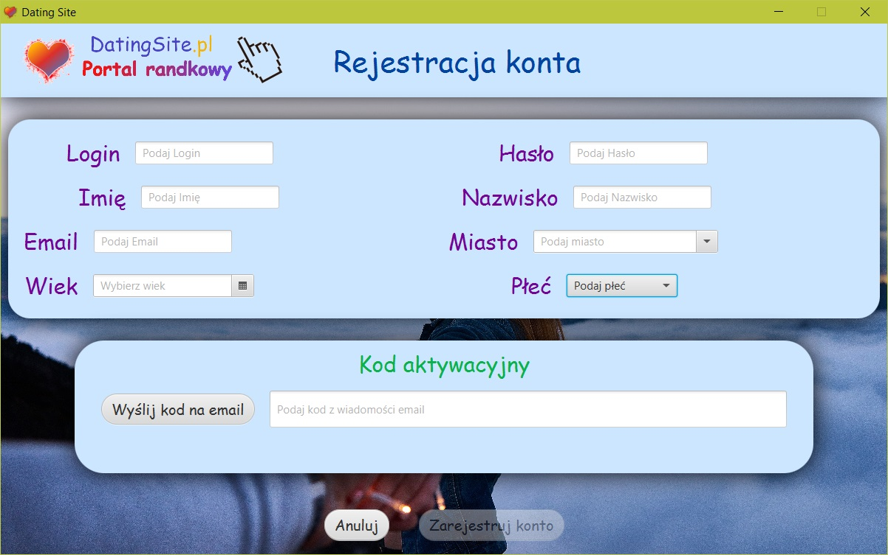
 
*Okno panelu rejestracji*
 
*Registration panel window*

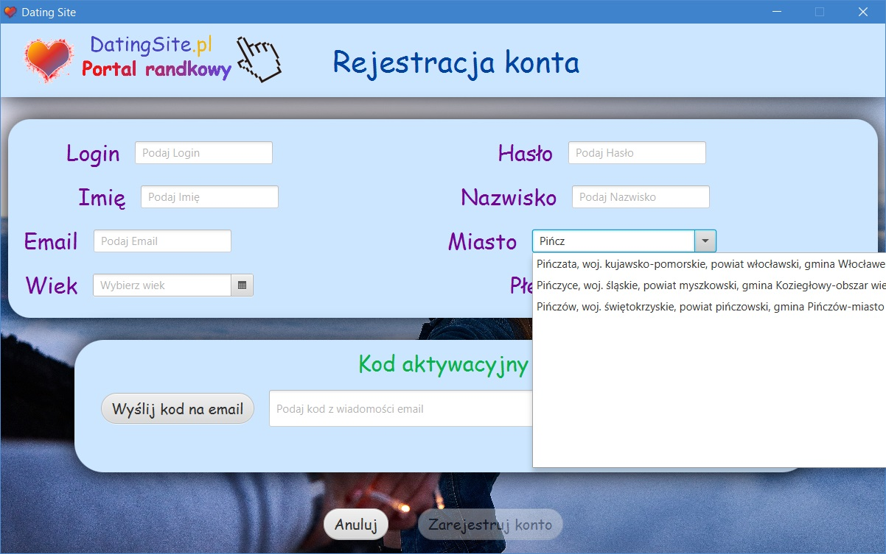
 
*Lista miejscowości jest podpowiadana po wpisaniu ciągu znaków*
 
*The city list is suggested after entering a string*

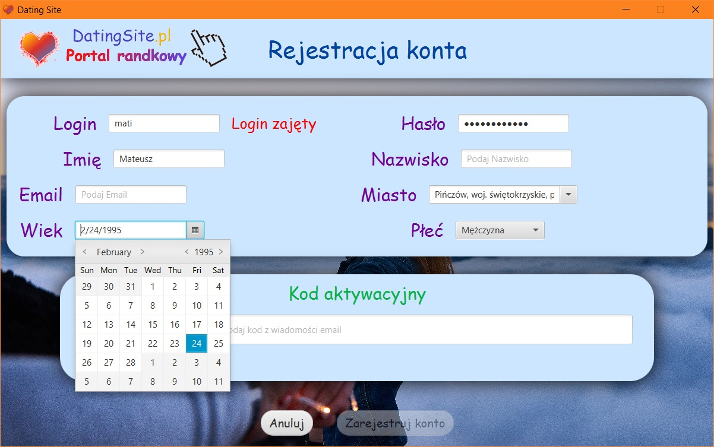
 
*Po wpisaniu wszystkich danych oraz sprawdzeniu przez aplikację wysłany zostanie kod aktywacyjny na podany e-mail*
 
*After entering all data and checking by the application, an activation code will be sent to the e-mail address provided*

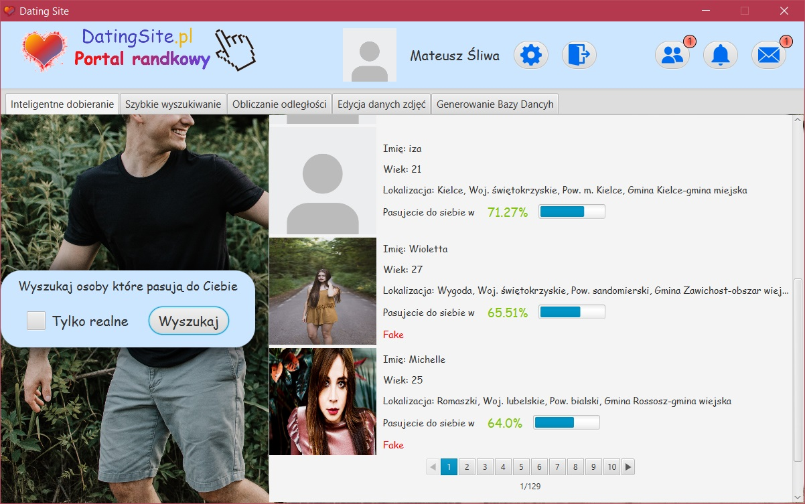
 
*Okno panelu głównego. W tej zakładce można dobierać automatycznie pary uzyskując procentowe dopasowanie. Możliwe jest też ustawienie wyszukiwania tylko dla realnych profili (nie wygenerowanych przez aplikację)*
 
*Main panel window. In this tab, you can automatically select pairs for a percentage match. It is also possible to set the search only for real profiles (not generated by the application)*

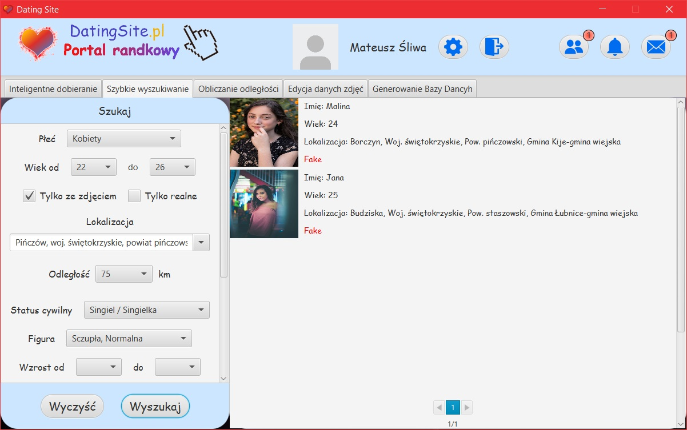
 
*Okno panelu głównego. Zakłada zawierająca wyszukiwarkę osób. Dostępne jest wyszukiwanie po większości cech użytkowników*
 
*Main panel window. It assumes a people search engine. A search is available for most user characteristics*

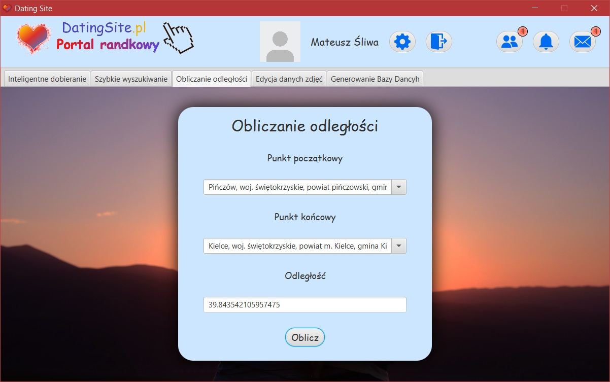
 
*Okno panelu administratora. Zakładka ta pozwala wyświetlać odległość między miejscowościami dostępnymi w systemie. Funkcja wykorzystywana do testowania*
 
*Administrator panel window. This tab allows you to display the distance between cities available in the system. The function used for testing*

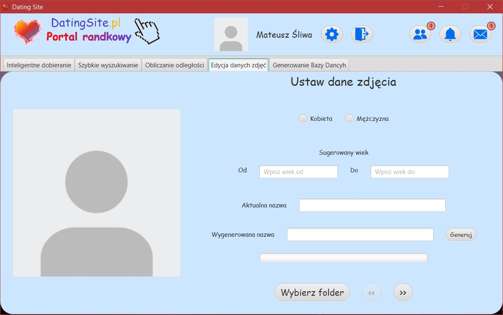
 
*Okno panelu administratora. Zakładka wykorzystywana do ustawiania danych i zdjęć do generatora profili. Przygotowuje specjalne dane w oparciu o zdjęcia, na podstawie których generator tworzy profile użytkowników*
 
*Administrator panel window. Tab used to set data and photos for the profile generator. Prepares special data based on photos, based on which the generator creates user profiles*

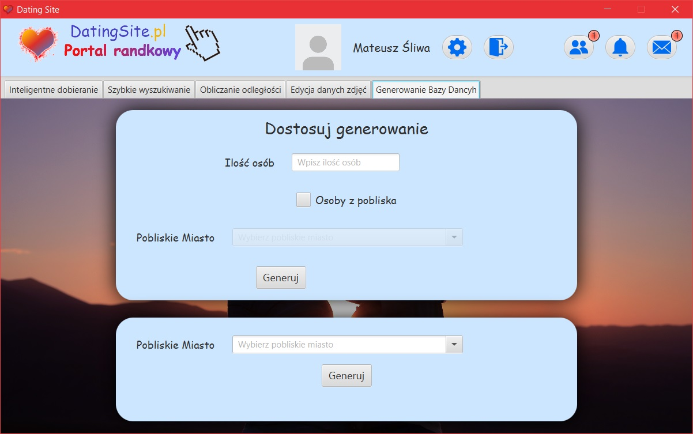
 
*Okno panelu administratora. Panel pozwala na generowanie danych użytkowników. Możliwe jest generowanie konkretnej ilości losowych danych z opcją wyboru osób z pobliskiej miejscowości. Drugą opcją jest generowanie specjalnie przygotowanych losowych profili na potrzeby testowania apliakcji. Obejmuje ona kilkaset osób bez zdjęć, osób ze zdjciami, osób z pobliska i z całej Polski.*
 
*Administrator panel window. The panel allows you to generate user data. It is possible to generate a specific amount of random data with the option to choose people from a nearby town. The second option is to generate specially prepared random profiles for the purposes of testing the application. It covers several hundred people without photos, people with photos, people from nearby and from all over Poland.*

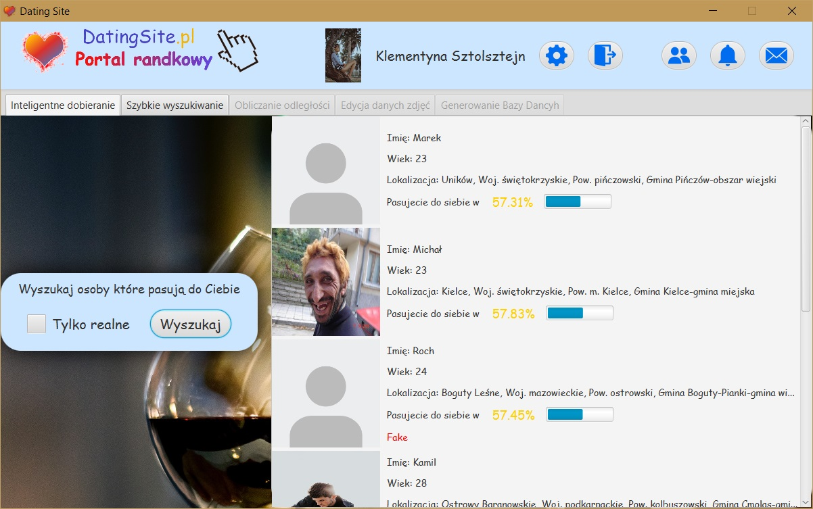
 
*Okno panelu głównego. W tym przypadku dla osoby niebędącej administratorem niekóre opcje są niedostępne.*
 
*Main panel window. In this case, some options are not available to the non-administrator.*

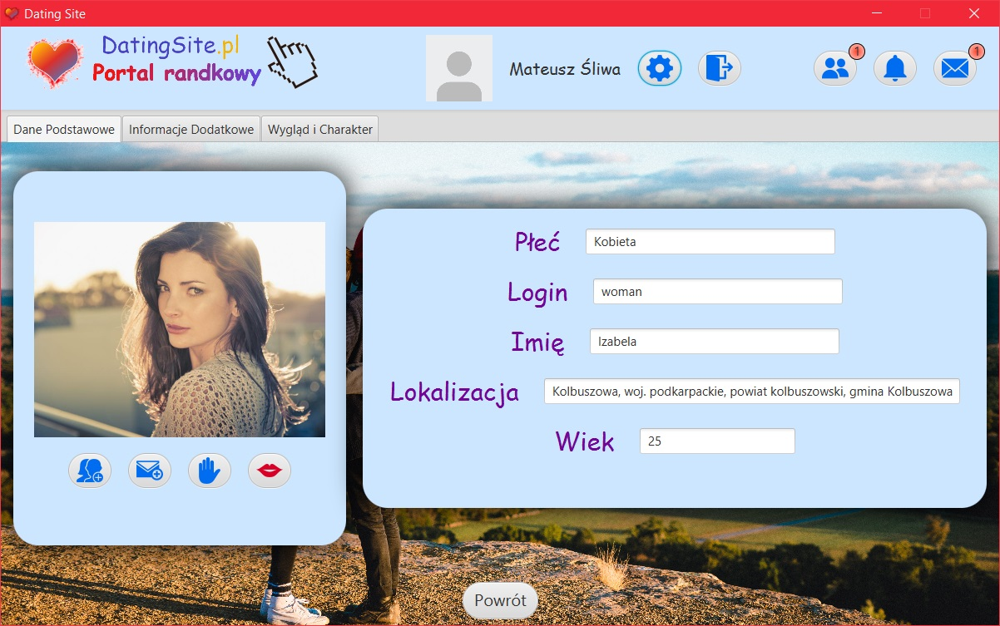
 
*Okno panelu wyświetlania informacji o użytkowniku. W tej zakładce dostępne są podstawowe informacje oraz panel szybkich akcji, które obejmują takie funkcje jak (w kolejności) dodawanie do znajomych, wysłanie wiadmości, wysłanie machnięcia ręką oraz wysłanie całusa.*
 
*User information display panel window. This tab provides basic information and a quick action panel that includes functions such as (in order) adding to friends, sending a message, sending a swipe with your hand and sending a kiss.*

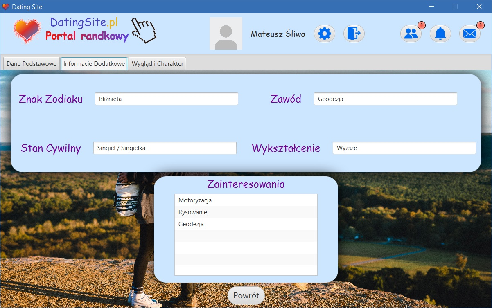
 
*Okno panelu wyświetlania informacji o użytkowniku. W tej zakładce dostępne są informacje dodatkowe.*
 
*User information display panel window. Additional information is available in this tab.*

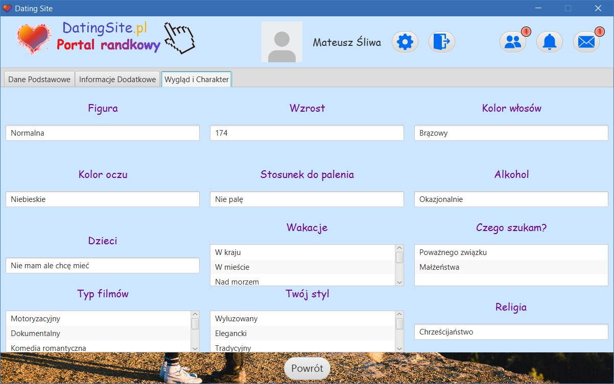
 
*Okno panelu wyświetlania informacji o użytkowniku. Zakładka ta wyświetla informacje o wyglądzie i charakterze użytkownika.*
 
*User information display panel window. This tab displays information about the user's appearance and character.*

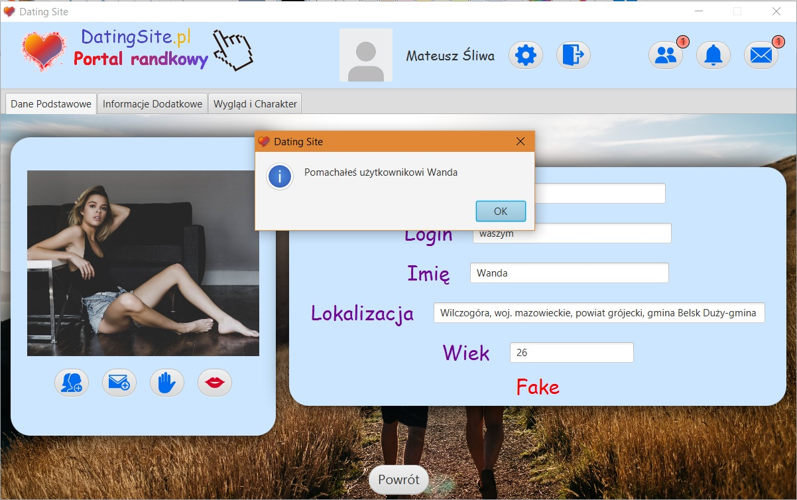
 
*Okno panelu wyświetlania informacji o użytkowniku. Wykonanie akcji pomachania użytkownikowi. Akcja ta będzie wyświetlona użytkownikowi w powiadomieniach wraz z linkiem do profilu użytkownika, który wysłał tę akcję.*
 
*User information display panel window. Performing a wave action on the user. This action will be displayed to the user in notifications with a link to the profile of the user who sent this action.*

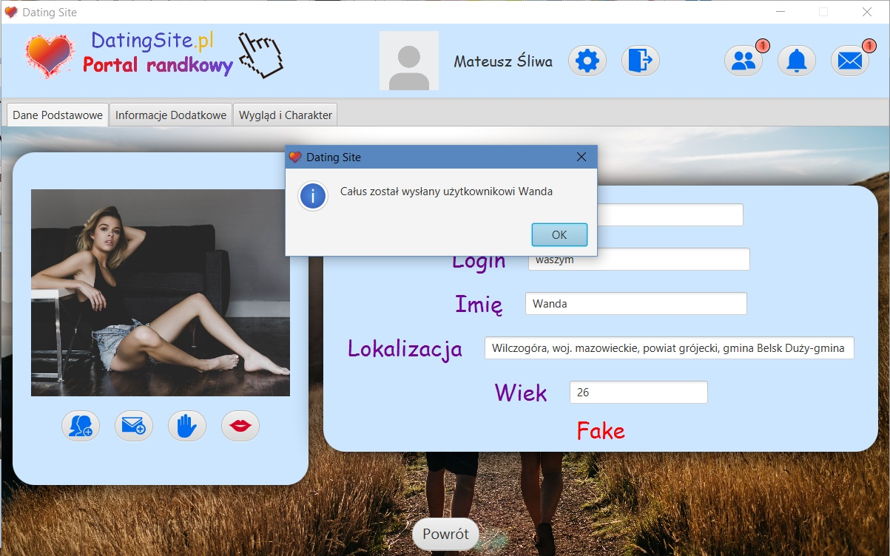
 
*Okno panelu wyświetlania informacji o użytkowniku. Wykonanie akcji wysłania całusa użytkownikowi. Akcja ta będzie wyświetlona użytkownikowi w powiadomieniach wraz z linkiem do profilu użytkownika, który wysłał tę akcję.*
 
*User information display panel window. Performing an action to send a kiss to the user. This action will be displayed to the user in notifications with a link to the profile of the user who sent this action.*

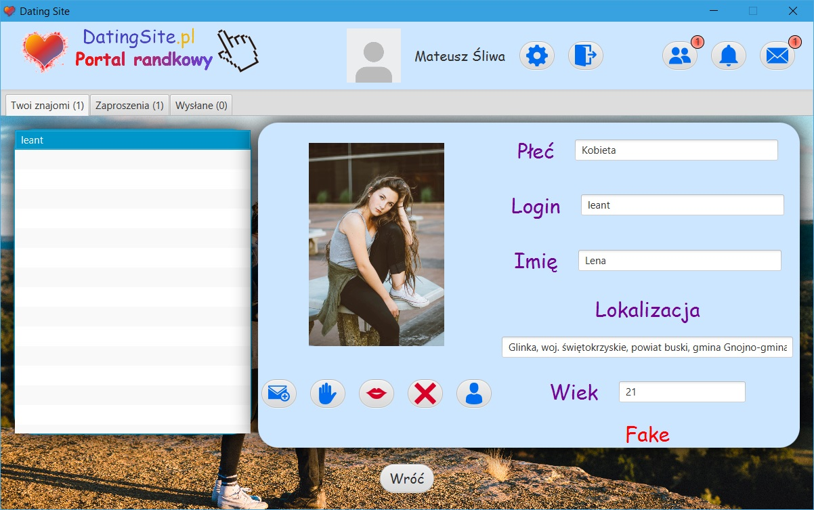
 
*Okno panelu znajomych. Zakładka z aktualnie posiadanymi znajomymi. Dostępne są tutaj podstawowe informacje o użytkowniku oraz szybkie akcje obejmujące (po kolei) wysłanie wiadomości, wysłanie machnięcia ręką, wysłanie całusa, usunięcie ze znajomych oraz wyświetlenie profilu. Po usunięciu znajomego ze swojej listy wyświetli mu się powiadmomienie o tym wydarzeniu*
 
*Friends panel window. Bookmark with currently owned friends. Basic information about the user is available here as well as quick actions including (in turn) sending a message, sending a hand swipe, sending a kiss, removing from friends and displaying the profile. After removing a friend from his list, he will be notified of this event*

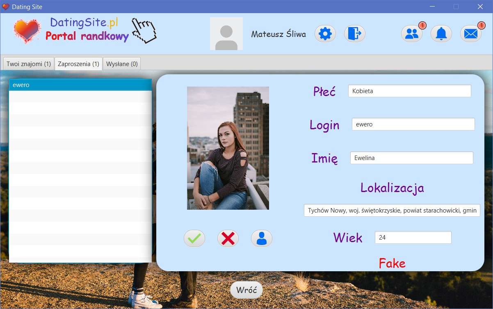
 
*Okno panelu znajomych. Zakładka z zaproszeniami do znajomych. Dostępne są tutaj podstawowe informacje o użytkowniku oraz szybkie akcje obejmujące (po kolei) zaakceptowanie zaproszenia, anulowanie zaproszenia oraz wyświetlenie profilu. Informacje o akceptacji zaproszenia bądź jego anulowania zostanie wyświetlone użytkownikowi wysyłającemu zaproszenie.*
 
*Friends panel window. Bookmark with invitations to friends. Basic user information is available here as well as quick actions including (one by one) accepting the invitation, canceling the invitation and displaying the profile. Information about accepting or canceling the invitation will be displayed to the user who sent the invitation.*

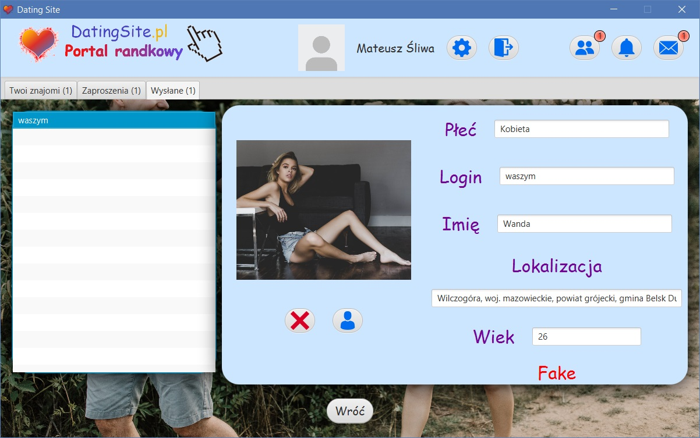
 
*Okno panelu znajomych. Zakładka z wysłanymi zaproszeniami. Dostępne są tutaj podstawowe informacje o użytkowniku oraz szybkie akcje obejmujące (po kolei) anulowanie zaproszenia oraz wyświetlenie profilu. Informacje o wysłaniu zaproszenia zostanie wyświetlone użytkownikowi.*
 
*Friends panel window. Bookmark with sent invitations. Basic user information is available here as well as quick actions including (one by one) canceling the invitation and displaying the profile. Information about sending the invitation will be displayed to the user.*

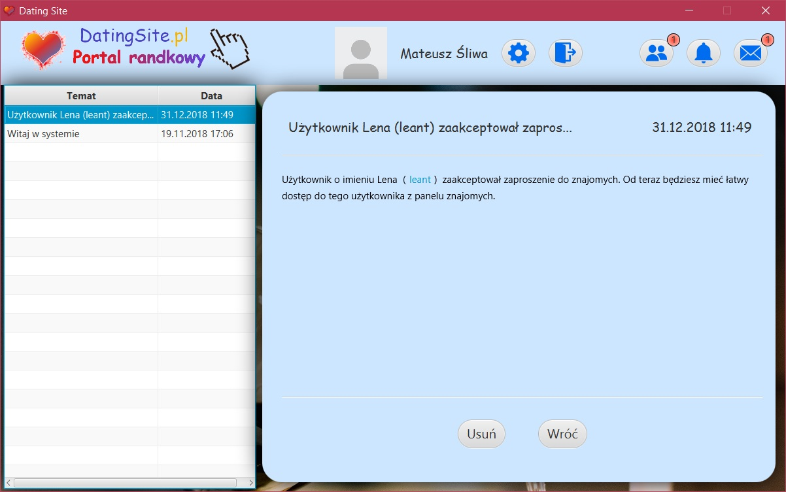
 
*Okno panelu powiadomień. Wyświetlane zostaja tutaj podstawowe informacje o powiadomieniu oraz możliwość jego usnięcia. W przypadku niektórych powiadomień możliwe jest np. przejście do profilu użytkownika będące hiperłączem.*
 
*Notification panel window. The basic information about the notification and the option to delete it are displayed here. For some notifications it is possible, for example, to switch to a user profile that is a hyperlink.*

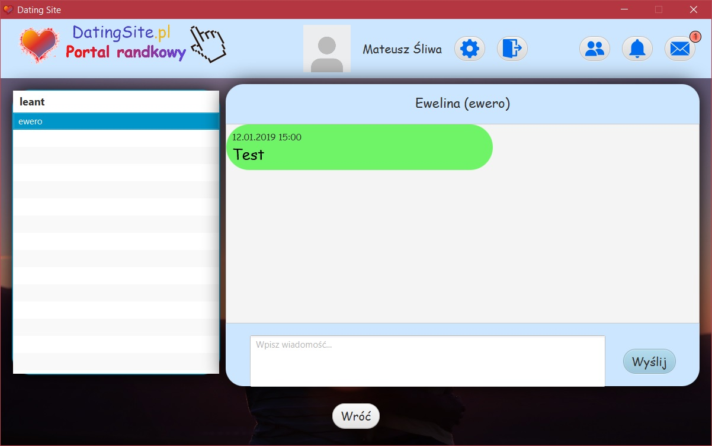
 
*Okno skrzynki z wiadomościami. Każdy użytkownik może posiadać dowolną ilość konwersacji. W konwersacji pojawiają się informacje czy dany użytkownik wyświetlił wiadomość oraz czy czy zosała wysłana.*
 
*Mailbox window. Each user can have any number of conversations. The conversation shows whether the user has viewed the message and whether or not it was sent.*

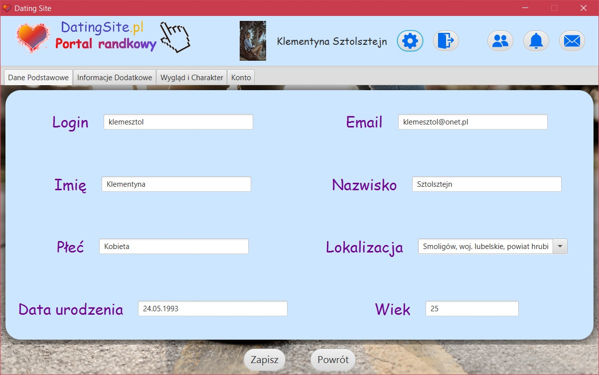
 
*Okno panelu ustawień danych podstawowych. Niektóre z tych danych są jedynie w celu poglądowym i nie da się ich zmienić*
 
*The basic data settings panel window. Some of these data are for illustrative purposes only and can not be changed*

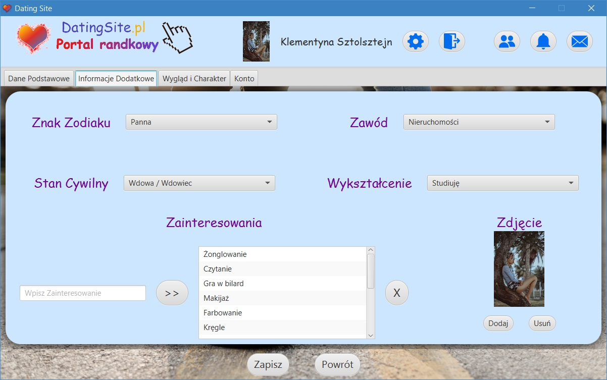
 
*Okno panelu ustawień. W tej zakładce możliwa jest zmiana dodatkowych informacji. W tej zakładce możliwe jest również dodanie, usunięcie lub zmiana zdjęcia profilowego.*
 
*The settings panel window. In this tab it is possible to change additional information. In this tab it is also possible to add, delete or change a profile photo.*

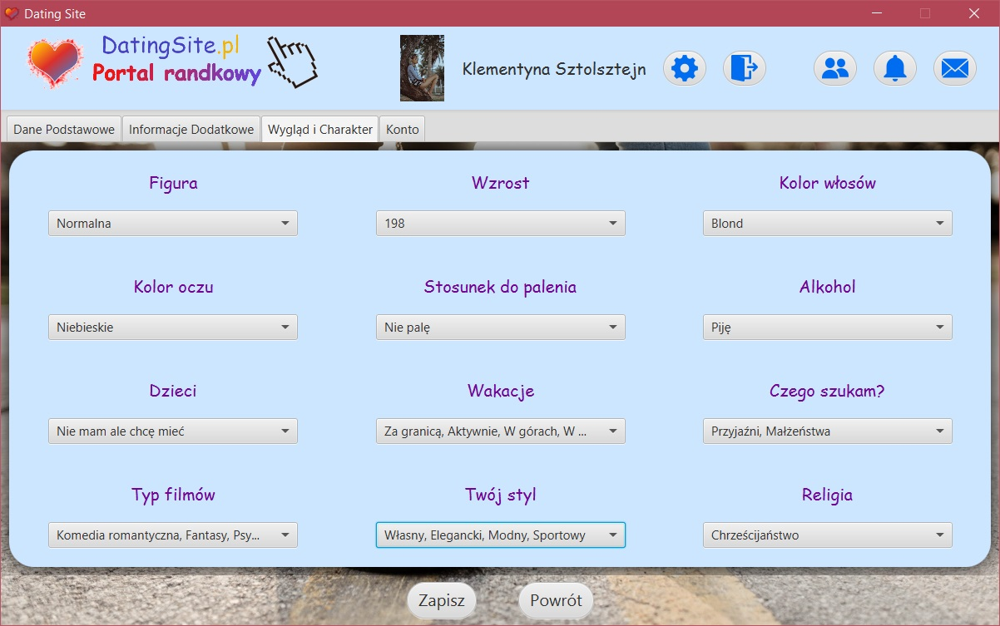
 
*Okno panelu ustawień. W tej zakładce możliwa jest zmiana ustawień wyglądu i charakteru. Niektóre z pól są jednokrotnego wyboru a inne wielokrotnego wyboru.*
 
*The settings panel window. In this tab it is possible to change the appearance and character settings. Some of the fields are single-choice and other multiple-choice.*

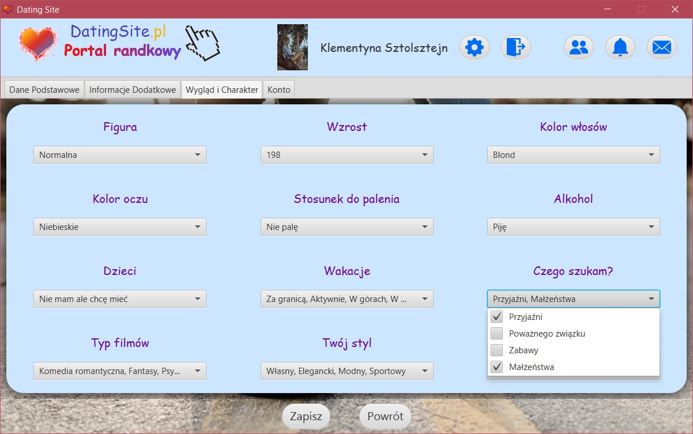
 
*Okno panelu ustawień. Przykład wyboru wielokrotnego.*
 
*The settings panel window. Example of multiple choice.*

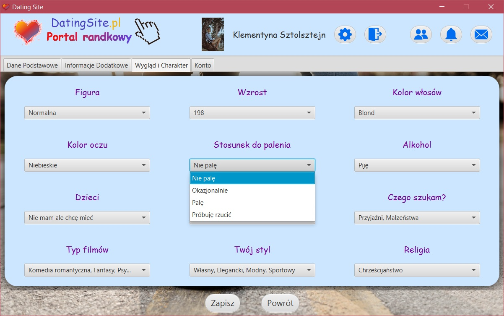
 
*Okno panelu ustawień. Przykład wyboru jednokrotnego.*
 
*The settings panel window. Example of single choice.*

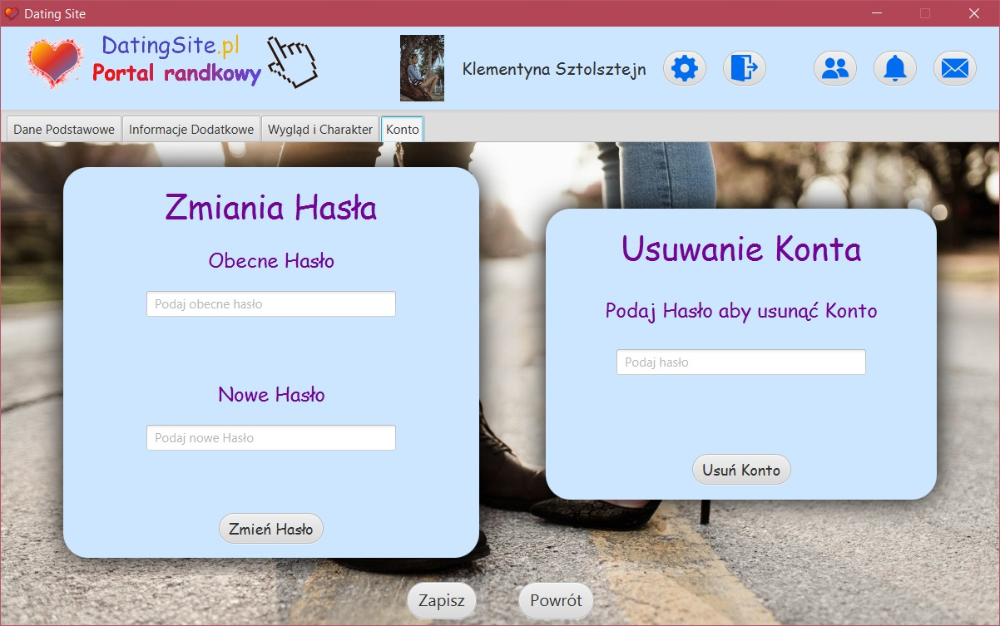
 
*Okno panelu ustawień. W tej sekcji można zmienić hasło oraz usunąć swoje konto z systemu.*
 
*The settings panel window. In this section you can change the password and delete your account from the system.*
